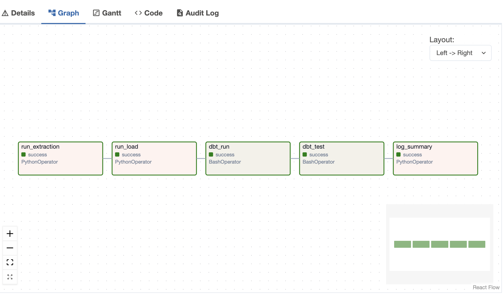
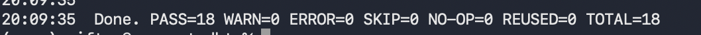
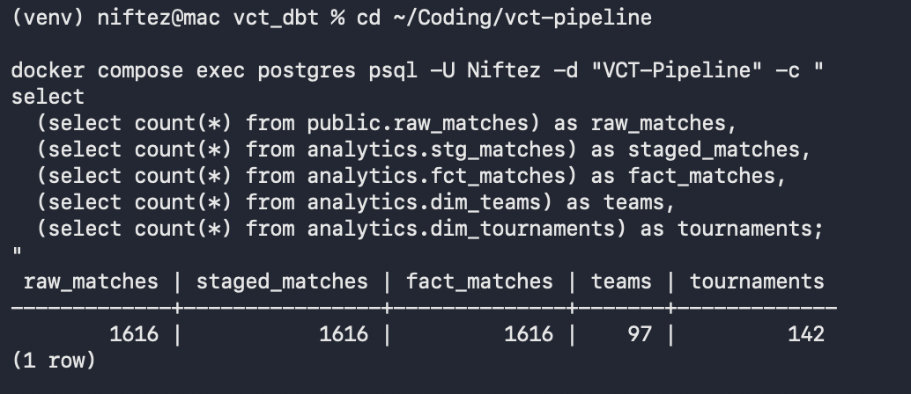

# VCT Match Data Pipeline

[](https://github.com/EthanSB-dev/VCT-Pipeline/actions/workflows/ci.yml)

An end-to-end ELT pipeline that ingests Valorant Champions Tour (VCT) match data from the PandaScore API, stores unmodified match payloads in PostgreSQL, transforms them into analytics-ready models with dbt, and orchestrates the workflow with Apache Airflow.

> **Status:** Complete local pipeline. A successful Airflow run executes extraction, loading, dbt transformations, and dbt data-quality tests in sequence.

## Overview

This project demonstrates a practical data-engineering workflow:

```text
PandaScore API
    ↓
Python extraction with VCT filtering and checkpoints
    ↓
PostgreSQL: public.raw_matches
    ↓
dbt: staging → intermediate → marts
    ↓
PostgreSQL analytics views
    ↓
Apache Airflow orchestration every 6 hours
```

The pipeline follows an ELT pattern: raw PandaScore match payloads are loaded without pre-transformation, then dbt parses and models the data in PostgreSQL.

## Features

- Extracts new flagship VCT match records from the PandaScore API
- Filters and checkpoints extraction runs to support incremental collection
- Loads raw, unmodified JSON payloads into PostgreSQL
- Uses dbt to build a layered analytics model:
  - `stg_matches` for typed, flattened match attributes
  - `int_match_teams` for match/team-level relationships
  - `dim_teams` and `dim_tournaments` as reusable dimensions
  - `fct_matches` as the final match-level analytics fact view
- Enforces data quality with dbt source and model tests
- Uses Docker Compose to run PostgreSQL, Airflow, and the project services locally
- Orchestrates extraction → load → dbt run → dbt test through an Airflow DAG scheduled every six hours
- Keeps API keys and database credentials outside source control through environment variables

## Architecture

```text
┌─────────────────┐
│ PandaScore API  │
└────────┬────────┘
         │
         ▼
┌───────────────────────────────────────────┐
│ Apache Airflow: vct_extraction DAG         │
│                                             │
│  run_extraction → run_load → dbt_run        │
│       → dbt_test → log_summary              │
└────────┬──────────────────────────────────┘
         │
         ▼
┌───────────────────────────────────────────┐
│ PostgreSQL                                  │
│                                             │
│ public.raw_matches                          │
│   → analytics.stg_matches                   │
│   → analytics.int_match_teams               │
│   → analytics.dim_teams                     │
│   → analytics.dim_tournaments               │
│   → analytics.fct_matches                   │
└───────────────────────────────────────────┘
```

## Tech Stack

| Category | Tools |
|---|---|
| Data source | PandaScore API |
| Extraction and loading | Python |
| Orchestration | Apache Airflow 2.9.3 |
| Storage | PostgreSQL 16 |
| Transformation and testing | dbt Core with dbt-postgres |
| Containerization | Docker and Docker Compose |
| Analytics design | dbt staging, intermediate, and mart layers |

## Pipeline Workflow

The Airflow DAG is named `vct_extraction` and runs every six hours using the schedule:

```text
0 */6 * * *
```

It executes the following tasks in order:

| Task | Responsibility |
|---|---|
| `run_extraction` | Retrieves new flagship VCT matches from PandaScore using an Airflow-managed API connection |
| `run_load` | Loads extracted raw JSON files into `public.raw_matches` using an Airflow-managed PostgreSQL connection |
| `dbt_run` | Creates or refreshes dbt staging, intermediate, and mart views |
| `dbt_test` | Runs source and model data-quality tests |
| `log_summary` | Logs extraction and loading completion timestamps |

A downstream task runs only after its prerequisite succeeds, preventing partial transformations after failed extraction or loading runs.

## Data Model

| Layer | Relation | Purpose |
|---|---|---|
| Raw | `public.raw_matches` | One row per PandaScore match ID with its unmodified JSON payload |
| Staging | `analytics.stg_matches` | Flattens raw JSON into typed match fields including status, timestamps, team IDs, scores, and winner |
| Intermediate | `analytics.int_match_teams` | Produces match-to-team relationships for downstream modeling |
| Mart | `analytics.dim_teams` | De-duplicated team dimension |
| Mart | `analytics.dim_tournaments` | De-duplicated tournament dimension |
| Mart | `analytics.fct_matches` | Final match-level fact view for VCT analysis |

The final fact view includes match identifiers, match name/status/type, best-of count, forfeit status, start/end timestamps, calculated duration, league and tournament identifiers, both teams and their scores, and winner information.

## Verified Results

A successful validation run produced the following results:

| Metric | Result |
|---|---:|
| Raw match records | 1,535 |
| Staged match records | 1,535 |
| Final fact-match records | 1,535 |
| Teams | 73 |
| Tournaments | 122 |
| dbt models built | 5 |
| dbt data tests passed | 13 |
| dbt build result | 18 passed, 0 warnings, 0 errors |

The matching raw, staged, and fact-table row counts demonstrate that the current transformation path preserves all ingested match records.

## Evidence

### Successful Airflow DAG Run

Replace the filename below if your Airflow screenshot has a different name.



### Successful dbt Build

Replace the filename below if your dbt screenshot has a different name.



### Pipeline Row-Count Validation

Replace the filename below if your database-count screenshot has a different name.



## Local Setup

### Prerequisites

- Docker Desktop with Docker Compose
- PandaScore API key
- Git
- Python 3.12+ if you want to run dbt from your host machine in addition to Airflow

### 1. Clone the Repository

```bash
git clone https://github.com/EthanSB-dev/VCT-Pipeline.git
cd VCT-Pipeline
```

### 2. Create Local Environment Variables

Copy the environment template:

```bash
cp .env.example .env
```

Fill in the values for:

- Postgres database user, password, and database name
- Airflow metadata database user, password, and database name
- Airflow admin account
- PandaScore API connection

Do not commit `.env`.

### 3. Start the Services

```bash
docker compose up -d --build
```

Confirm services are running:

```bash
docker compose ps
```

Expected services include:

- VCT PostgreSQL database
- Airflow metadata PostgreSQL database
- Airflow scheduler
- Airflow webserver

### 4. Open Airflow

Open:

```text
http://localhost:8080
```

Sign in with the Airflow administrator credentials configured in `.env`.

Find the `vct_extraction` DAG, unpause it if necessary, and trigger a run manually. A successful run turns all five tasks green:

```text
run_extraction → run_load → dbt_run → dbt_test → log_summary
```

## Running dbt Locally

Airflow already runs dbt as part of the scheduled workflow. For local development or debugging:

```bash
python -m venv venv
source venv/bin/activate
pip install dbt-postgres

cd transform/vct_dbt
dbt debug
dbt build
```

When dbt runs from the host machine, the profile defaults to `localhost`. When dbt runs inside the Airflow Docker container, `POSTGRES_HOST=postgres` routes the connection through Docker Compose networking.

## Data Quality

The dbt project includes source and model tests that protect key fields:

- `raw_matches.match_id` is unique and not null
- `raw_matches.raw_payload` is not null
- Match IDs in staging and final fact models are unique and not null
- Team IDs and tournament IDs in dimension models are unique and not null

Run the full transformation and validation suite:

```bash
cd transform/vct_dbt
dbt build
```

A successful build currently produces:

```text
PASS=18 WARN=0 ERROR=0 SKIP=0
```

## Continuous Integration

Every push and pull request to `main` runs a GitHub Actions workflow ([`.github/workflows/ci.yml`](.github/workflows/ci.yml)) with two jobs:

| Job          | What it validates                                                                                                 |
| ------------ | ------------------------------------------------------------------------------------------------------------------ |
| `python-tests` | Unit tests (`pytest`) for the extraction logic — VCT flagship-series filtering rules and checkpoint read/write behavior. No network or database required. |
| `dbt-build`    | Spins up a real Postgres 16 service container, loads a small fixture of raw match payloads through the actual `load_matches.py` script, then runs `dbt build` — the same staging → intermediate → marts models and all 13 data-quality tests used in production. |

This means a pull request that breaks the flagship-match filtering logic, the checkpoint mechanism, or any dbt model or test fails CI before it can reach `main` — the same failure modes that would otherwise only surface in a scheduled Airflow run.

## Dashboard

A Streamlit app in [`dashboard/app.py`](dashboard/app.py) reads directly from the `analytics.*` marts and renders:

- Team win rates (bar chart, filterable by minimum matches played), from `dim_teams`
- Tournament summary table, from `dim_tournaments`
- Recent finished matches, from `fct_matches`

The dashboard contains no transformation logic of its own — it queries what dbt already built. If a number on the dashboard looks wrong, the bug is upstream in the pipeline, not in the dashboard code.

### Running the dashboard locally

```text
cd dashboard
pip install -r requirements.txt
streamlit run app.py
```

The app reads the same `POSTGRES_HOST`, `POSTGRES_USER`, `POSTGRES_PASSWORD`, and `POSTGRES_DB` environment variables as the rest of the pipeline, so it works with the same `.env` file — no separate configuration. If running outside Docker against the Dockerized Postgres, set `POSTGRES_HOST=localhost`.

## Analysis Opportunities

This project is complete as a data-engineering portfolio project. The final `analytics.fct_matches` mart powers the dashboard above and provides a foundation for further analysis.

Possible analysis questions include:

- Which teams have the highest win rate?
- Which teams have played the most matches?
- How do match durations differ by best-of format?
- Which tournaments have the most matches?
- What are the head-to-head records between teams?
- How often do forfeits occur?
- How has tournament participation changed over time?

For example, this SQL calculates matches played, wins, and win rate by team:

```sql
with team_results as (
    select
        team_a_id as team_id,
        team_a_name as team_name,
        case when winner_id = team_a_id then 1 else 0 end as won
    from analytics.fct_matches
    where match_status = 'finished'

    union all

    select
        team_b_id as team_id,
        team_b_name as team_name,
        case when winner_id = team_b_id then 1 else 0 end as won
    from analytics.fct_matches
    where match_status = 'finished'
)

select
    team_name,
    count(*) as matches_played,
    sum(won) as wins,
    round(100.0 * sum(won) / nullif(count(*), 0), 2) as win_rate_pct
from team_results
group by team_id, team_name
having count(*) >= 10
order by win_rate_pct desc, matches_played desc;
```

## Repository Structure

```text
.
├── .github/
│   └── workflows/
│       └── ci.yml                 # GitHub Actions: pytest + dbt build on every PR
├── dags/
│   └── vct_extraction_dag.py      # Airflow extract → load → transform workflow
├── extract/
│   ├── pandascore_client.py       # PandaScore API client
│   ├── extract_matches.py         # Incremental VCT match extraction
│   ├── vct_filters.py             # VCT/flagship filtering rules
│   └── checkpoint.py              # Extraction checkpoint management
├── load/
│   └── load_matches.py            # Raw JSON loading into PostgreSQL
├── transform/
│   └── vct_dbt/                   # dbt project: sources, models, tests, and macros
├── tests/
│   ├── test_vct_filters.py        # Unit tests for flagship-match filtering
│   ├── test_checkpoint.py         # Unit tests for checkpoint read/write
│   └── fixtures/
│       └── matches_ci_fixture.json  # Sample raw payloads used to seed CI's dbt build
├── dashboard/
│   ├── app.py                     # Streamlit dashboard reading from analytics marts
│   └── requirements.txt           # Dashboard-specific dependencies
├── docs/
│   └── images/                    # Airflow, dbt, and validation screenshots
├── docker-compose.yml             # Local services and Docker networking
├── Dockerfile                     # Airflow image with dbt and Git
├── requirements.txt               # Runtime deps for extract/load scripts
├── requirements-dev.txt           # requirements.txt + pytest
└── .env.example                   # Required environment-variable template
```

## Future Enhancements

- Add dbt source-freshness checks and relationship tests
- Add pipeline alerts for Airflow task failures
- Add map-level, player-level, and event-stage analytics when supported by source data
- Add longer-term trend analysis and team-performance reporting

## Security

- Keep credentials in `.env` and Airflow connection/environment variables
- Never commit API keys, passwords, connection URIs containing secrets, or `.env`
- Use `.env.example` only as a variable template with placeholder values

## License

This project is intended for portfolio use.